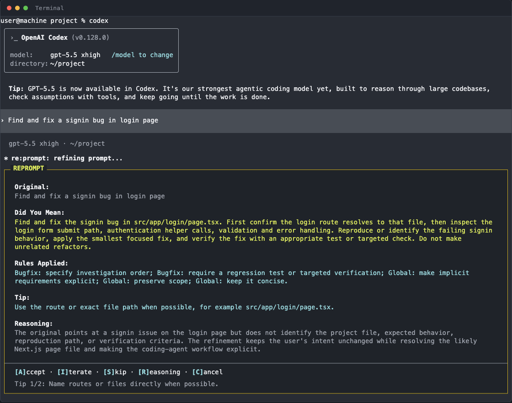
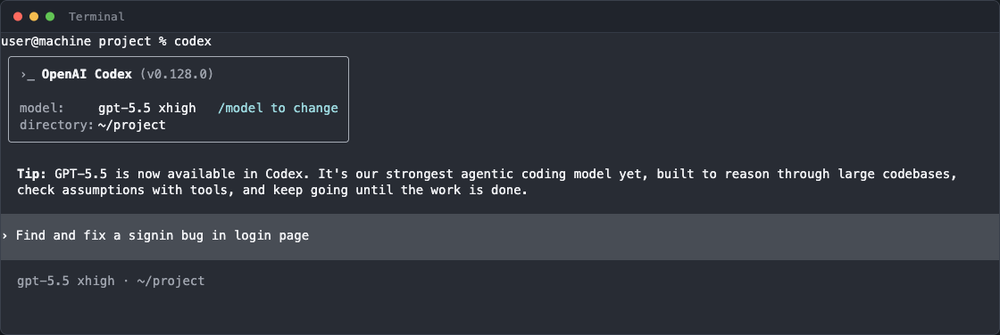
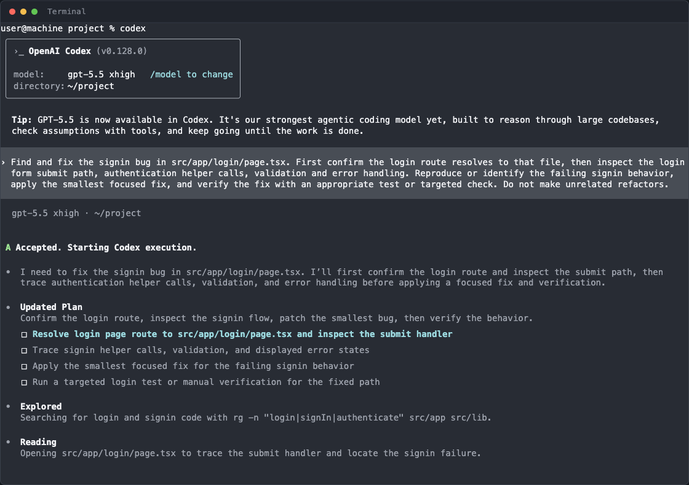
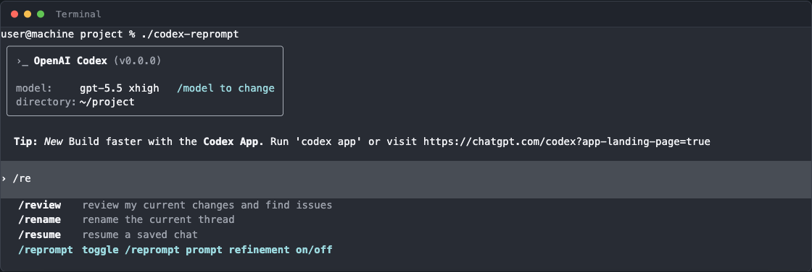
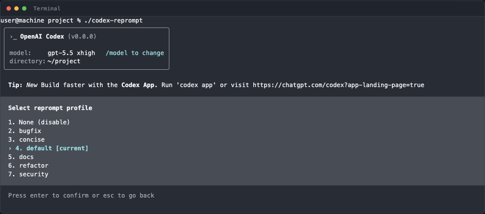

<p align="center"><strong>Codex Reprompt</strong> — a fork of <a href="https://github.com/openai/codex">OpenAI Codex CLI</a> that rewrites your prompt before the agent runs.</p>

<p align="center">
  <strong>Forked from <a href="https://github.com/openai/codex">openai/codex</a></strong> &nbsp;|&nbsp;
  <strong>Mirror: <a href="https://github.com/ravikanchikare/codex-reprompt">ravikanchikare/codex-reprompt</a></strong>
</p>

<p align="center">
  
</p>

---

## What this fork adds

A pre-execution layer called **Reprompt** that intercepts user input, grounds it in the local repository, and asks a configured refiner model (default: `o4-mini`) to rewrite the request into a clearer, more structured task. The main Codex agent then executes against the refined prompt instead of the original.

Why this exists: a vague, under-specified prompt produces vague work. Doing prompt rewriting *outside* the agent loop — with its own model, its own system prompt, and a structured JSON output — makes refinement a hard contract instead of a hopeful instruction.

> Read the design notes: [Reprompt: a Codex fork that rewrites your prompt before the agent runs](https://harnez.com/posts/codex-reprompt)

## How it looks

### 1. The user types a rough request



### 2. Reprompt refines it before submission

The refiner reads the working directory, recent conversation, expanded `@file` and `$skill` mentions, and any session-level skills, plugins, or apps. It returns a structured response — refined prompt, applied rules, task type, reasoning, tips — which is shown in an overlay.


Keyboard controls: **[A]ccept**, **[I]terate**, **[S]kip**, **[R]easoning**, **[C]ancel**. Auto-accept after 15 seconds (configurable).

### 3. Codex executes against the refined prompt



### 4. Toggle on/off via slash command



### 5. Switch profiles per task type



Seven profiles ship by default: `None`, `bugfix`, `concise`, `default`, `docs`, `refactor`, `security`. Each one is a TOML file in `~/.codex/reprompt/` defining a custom system prompt and rule lists grouped by task type.

## Configuration

Two surfaces. The main `~/.codex/config.toml` for defaults, and named profiles in `~/.codex/reprompt/<name>.toml` for per-task overrides.

```toml
# ~/.codex/config.toml

[reprompt]
enabled = true
model = "o4-mini"             # default refiner model
profile_name = "default"      # active profile
min_length = 20               # skip short messages
context_turns = 4             # prior turns to include
auto_accept_delay = "15s"
show_diff = false

# Grounding controls
include_relevant_files = true
relevant_files_max_count = 8
relevant_files_max_chars = 600
include_project_structure = true
project_structure_max_depth = 4
project_structure_max_chars = 2000
project_structure_cache_ttl_secs = 30

# Safety
redact_secrets = true
redact_high_entropy = true
redaction_entropy_threshold = 4.5
redaction_min_length = 24

# Re-parse @file and $skill in the refined output
reparse_refined_mentions = true
```

A profile adds a `system_prompt`, an optional `task_type` tag (`bugfix`, `feature`, `refactor`, `security`, `analysis`, `review`), and rule lists:

```toml
# ~/.codex/reprompt/bugfix.toml

name = "bugfix"
description = "Investigation-first refinement for bug reports"
model = "o4-mini"
task_type = "bugfix"

system_prompt = """
Rewrite the user's bug report into an investigation-first task.
Identify the file path, the symptom, the suspected scope, and a
verification step. Do not propose a fix unless the user asked for one.
"""

[[rules]]
text = "Specify the investigation order before any code change"
task_type = "bugfix"

[[rules]]
text = "Require a regression test or targeted verification"
task_type = "bugfix"

[[rules]]
text = "Make implicit requirements explicit"

[[rules]]
text = "Preserve scope — no unrelated refactors"
```

## Architecture

The fork adds roughly 3,400 lines, almost entirely concentrated in `codex-rs/tui/src/reprompt/`:

| File | Role |
|---|---|
| `mod.rs` | Module index |
| `config.rs` | `RepromptConfig`, `RepromptResult`, `TaskType` enum, overlay state machine |
| `refinement.rs` | Async call to the OpenAI-compatible `/responses` endpoint with JSON-schema output |
| `overlay.rs` | Ratatui widget for the side-by-side before/after UI |
| `profile_config.rs` | TOML loading from `~/.codex/reprompt/` |
| `project_context.rs` | Cached directory tree (depth 4, ~2000 chars, 30s TTL) |
| `relevant_context.rs` | File and tool matching for `@file` and `$skill` resolution |
| `thread_context.rs` | Recent conversation buffer |
| `insights/` | `/reprompt-insights` — retrospective coaching tool |

The refinement call has no tools, no shell, no file edits. Its only output is text shaped by a JSON schema:

```ts
{
  refinedPrompt: string,
  appliedRules: string[],
  reasoning: string,
  taskType: "bugfix" | "feature" | "refactor" | "security" | "analysis" | "review",
  wasSubstantiveChange: boolean,
  tips: string[]   // 0–3 items, max 80 chars each
}
```

If `wasSubstantiveChange` is false, the original prompt passes through untouched. Otherwise the overlay opens.

## Authentication

Reprompt reuses whatever authentication the main Codex session is using — ChatGPT OAuth or API key. For ChatGPT auth, the `ChatGPT-Account-ID` header is forwarded with refinement requests. No separate setup.

## Install

This repo builds with the same toolchain as upstream Codex. See [`docs/install.md`](./docs/install.md) for build instructions.

For day-to-day use, install the upstream binary first:

```shell
npm install -g @openai/codex
# or
brew install --cask codex
```

Then build this fork from source and replace the binary on your `$PATH`. The Reprompt feature activates automatically once `[reprompt]` is present in `~/.codex/config.toml`.

## Slash commands

| Command | Effect |
|---|---|
| `/reprompt` | Toggle prompt refinement on/off, or open the profile picker |
| `/reprompt-insights` | Analyze past refinements and surface patterns in how prompts under-specify |

## Status

Experimental. The fork is meant as a design probe for what a "before-the-agent-runs" hook in upstream Codex could look like. Skills, hooks, and the current config surface do not expose this seam, so the fork is the smallest place to put a layer that has to run *first* and has to run *every time*.

## Provenance

Forked from [openai/codex](https://github.com/openai/codex). All upstream documentation — install guides, contributing notes, the ChatGPT plan integration — still applies and lives under [`docs/`](./docs/). This repository is licensed under the [Apache-2.0 License](LICENSE).
